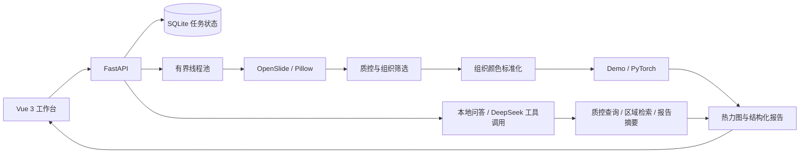

# PathoScope · 肿瘤病理切片分析智能体

一个可以本地运行的数字病理研究项目，串联 **切片读取 → 质控 → 组织切块 → 染色标准化 → 区域评分 → 热力图 → 结构化报告 → 工具调用问答**。

**Python / FastAPI / PyTorch / OpenSlide / Vue 3 / SQLite / Docker**

> 医院原始数据与内部训练资料不公开。本仓库提供可复现工程代码、带来源与许可的公开 PathMNIST 样本，以及实际运行的轻量训练记录。默认工作台使用规则演示评分，DeepSeek 负责证据问答；这些结果不构成临床验证。

## 快速体验

需要 Python 3.11+、Node.js 22.18+ 或 24.12+。

```bash
git clone https://github.com/fish0976/pathology-slide-agent.git
cd pathology-slide-agent
python -m venv .venv
# Windows PowerShell
.venv\Scripts\Activate.ps1
# macOS / Linux: source .venv/bin/activate
pip install -e ".[dev]"
npm --prefix frontend ci
npm --prefix frontend run build
python -m uvicorn pathology.main:app --host 127.0.0.1 --port 8000
```

打开 **http://127.0.0.1:8000**，点击「体验合成样本」。无需 GPU、API Key 或真实切片即可体验分析、热力图、区域定位、问答及报告下载。

Windows 也可以运行仓库根目录的 `start.ps1`（首次会安装依赖并构建页面）。API 文档位于 `/docs`。运行数据保存在 `data/`，已排除出 Git。

## 已实现的能力

| 模块 | 实现与适用边界 |
| --- | --- |
| 切片接入 | PNG/JPEG；安装可选依赖后使用 OpenSlide 读取 SVS/NDPI/受支持的 tiled TIFF |
| 大切片处理 | 按金字塔层级和 level-0 坐标读图；最多 512 个采样图块；不展开整张 WSI |
| 质控 | 组织占比、拉普拉斯清晰度、深色比例；启发式阈值，没有验证过的折叠/气泡分类器 |
| 染色标准化 | 只对组织像素做 RGB 均值方差匹配；不是 Macenko/Reinhard 或经临床验证的算法 |
| 模型接口 | 默认 DemoPredictor；可切换本地 PyTorch 小型 CNN 二分类基线，加载失败会报错 |
| 分析工作流 | 读取、质控、切块推理、热力图、报告五步执行轨迹；有界任务队列、进度与错误状态 |
| 区域证据 | 透明热力图叠加、研究分数排序、原始坐标定位；未采样区域不着色 |
| 报告 | 包含模式、采样覆盖、参数、指标、区域、局限及工具轨迹的 JSON / Markdown |
| 研究助手 | 无密钥时本地证据查询；配置密钥后使用 DeepSeek / 千问兼容工具调用，最多四轮、每轮三个工具 |
| 训练与评估 | CSV 数据清单、患者级数据集隔离、验证集选模、独立测试集混淆矩阵/准确率/敏感度/特异度/F1 |
| 公开数据 | 官方 PathMNIST 下载与校验、保留原划分的分层子集、九张授权样本、来源和论文引用 |
| 测试 | 输入边界、异常链路、透明报告、巨幅切片采样、模型回退、患者泄漏检测、前端构建与 CI |

## 架构



分析流水线是确定性工作流；可选大模型只调度只读的证据工具进行问答，不自行执行任意代码或启动额外训练。当前没有多模态图像问答、RAG 规范库或任意区域高分辨率浏览器。

## WSI 切片

```bash
pip install -e ".[wsi]"
```

OpenSlide 使用原生解码库；`openslide-bin` 提供常见平台二进制。不是所有 `.tiff` 都是 OpenSlide 支持的 WSI。普通 PNG/JPEG 限制 4000 万像素；上传默认 256 MB，可通过 `MAX_UPLOAD_MB` 调整。上传采用分块落盘，但没有分片断点续传。

图块坐标始终使用 level 0。所选层级负责确定实际读取像素和下采样倍数。均匀采样包含网格首尾位置，在超大尺寸下仅产生 O(max_tiles) 个坐标。报告中的 `grid_coverage` 是 **已采样网格数 / 当前层级全部网格数**，不是肿瘤面积或诊断覆盖率。

## PyTorch 训练入口

没有可公开的医院数据时，可先运行公开数据实验：

```bash
pip install -e ".[ml]"
python scripts/prepare_pathmnist.py --download
python scripts/train.py --manifest data/pathmnist/manifest.csv --split-policy official --balance-classes --epochs 5 --output weights/pathmnist.pt
```

参见 [数据来源、许可及复现说明](docs/public-data.md) 与 [公开样本及实测记录](examples/pathmnist/README.md)。这里使用公开病理图块，不属于自有医院训练成果。医院数据的通用清单训练方式如下：

```bash
pip install -e ".[ml]"
python scripts/train.py --manifest data/manifest.csv --epochs 5 --output weights/model.pt
```

清单示例（路径相对于 CSV 文件所在目录；每个 split 都必须同时含 0 和 1 类）：

```csv
path,label,patient_id,split
patches/a.png,0,patient_001,train
patches/b.png,1,patient_002,train
patches/c.png,0,patient_003,val
patches/d.png,1,patient_004,val
patches/e.png,0,patient_005,test
patches/f.png,1,patient_006,test
```

必须使用有使用授权和专业标签的数据。同一患者不得跨集合，训练入口会拒绝此类泄漏。训练使用图块级 BCE 损失与固定随机种子，以验证损失保存最优权重，最后仅在测试集评估。小型 CNN 是跑通训练/推理接口的基线，不是病理基础大模型。评估单位是图块，不可直接宣传为患者级或切片级准确率。分母为 0 的指标输出 `null`。

PowerShell 启用研究权重：

```powershell
$env:MODEL_BACKEND = 'torch'
$env:MODEL_WEIGHTS = 'weights/model.pt'
python -m uvicorn pathology.main:app --host 127.0.0.1 --port 8000
```

训练采用与默认推理相同的 RGB 标准化与 128×128 缩放。使用该训练入口生成的权重时，应保持页面「染色标准化」开启。仅加载可信来源的模型权重。

## DeepSeek 研究助手

默认不调用外部模型。配置后会发送 **当前问题、质控指标、采样统计、区域坐标和分析摘要**；不会发送原始切片、图像或上传文件名。

把 `.env.example` 复制为项目根目录的 `.env`，填写你自己的密钥：

```dotenv
LLM_BASE_URL=https://api.deepseek.com
LLM_MODEL=deepseek-flash
LLM_API_KEY=在本地填写密钥
```

后端自动读取项目根目录 `.env`，显式环境变量优先；修改后需重启服务。真实 `.env` 已被 Git 与 Docker 构建上下文排除，GitHub 上只有空密钥模板。页面显示已配置的服务商，回答显示实际来源与模型；配置成功并不等于每次请求都成功。

首次模型请求强制查询证据工具，随后生成回答。DeepSeek 默认关闭思考模式以减少响应等待；工具循环兼容服务商返回的 `reasoning_content` 字段，该字段不提供给前端或写入报告。认证失败、余额不足、限流、网络异常会显示具体原因，并返回本地证据回答。工具为 `get_quality`、`get_regions`、`get_report`，均不接受额外参数。

如果使用千问，可将地址与模型改回 `https://dashscope.aliyuncs.com/compatible-mode/v1`、`qwen-plus` 并配置对应服务商的密钥。不要把患者身份信息写进问题。此次接入的是问答推理服务；医院病理模型的训练、权重加载和评估属于独立链路，需要提供相应数据、标注与模型结构。详见 [DeepSeek 接入说明](docs/deepseek.md)。

## 开发、测试与部署

```bash
python -m pytest -q
python -m ruff check .
npm --prefix frontend run build
```

前端开发：`npm --prefix frontend run dev`，Vite 会将 `/api` 转发给本地 8000 端口。

```bash
docker compose up --build
```

Docker 配置包含 WSI 读取依赖，默认仍为演示模型。卷 `pathology-data` 保存运行数据；宿主机端口只绑定 127.0.0.1。当前没有登录、权限隔离、加密存储或多租户能力，仅支持单机单用户研究。不要直接暴露到公网。Uvicorn 只运行一个 worker，SQLite 任务恢复逻辑与内存队列不支持多进程共享调度。生产化需替换为任务队列并补充鉴权和存储管理。

## 目录

```text
pathology/      后端、切片处理、模型适配、工具问答
frontend/       Vue 3 工作台
scripts/        模型训练与评估
tests/          自动化测试
docs/           架构、测试设计与项目讲解
.github/        GitHub Actions
```

更多说明：[架构设计](docs/architecture.md) · [测试设计](docs/testing.md) · [项目讲解](docs/project-notes.md)。

## 下一阶段

- 接入经授权的病理基础模型、病种标签与患者级外部测试集。
- 使用专门标注的数据训练折叠、气泡检测与组织/病灶分割。
- 加入 OpenSeadragon 深度缩放与可审阅的医生标注。
- 接入带版本及引用出处的病理规范知识库、多模态图像问答。
- 增加切片级/患者级评价、校准、置信区间与跨中心泛化分析。

## 参考实现文档

- [OpenSlide Python：区域读取与金字塔坐标](https://openslide.org/api/python/)
- [FastAPI：UploadFile](https://fastapi.tiangolo.com/tutorial/request-files/)
- [PyTorch：权重加载](https://docs.pytorch.org/docs/stable/generated/torch.load)
- [千问：Function Calling](https://help.aliyun.com/zh/model-studio/qwen-function-calling)
- [DeepSeek：工具调用](https://api-docs.deepseek.com/guides/tool_calls/)
- [DeepSeek：思考模式与工具消息](https://api-docs.deepseek.com/guides/thinking_mode/)
- [Vue 3：快速上手](https://cn.vuejs.org/guide/quick-start)

代码采用 MIT License。公开 PathMNIST 样本单独采用 CC BY 4.0，详见 [第三方数据声明](THIRD_PARTY_NOTICES.md)。合成示例由本项目程序生成。
