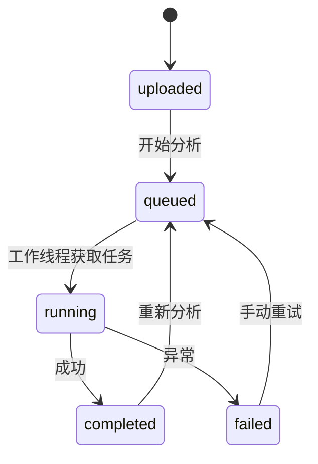

# 架构与约束

## 数据流

1. 文件分块落盘，使用服务端 UUID 目录隔离；原文件名仅作为界面标签。
2. 读取缩略图验证文件与格式。PNG/JPEG 设置像素上限，WSI 使用 OpenSlide。
3. SQLite 持久化任务；两个工作线程，最多四个运行/排队任务，超限返回 429。
4. 按层级计算均匀采样网格，逐块读取。组织比例低于 10% 的图块跳过。
5. 标准化后调用模型适配器，记录坐标、图块大小、分数和质控值。
6. 输出透明叠加图与 JSON 报告。前端通过轮询显示进度，避免长 HTTP 推理请求。
7. 研究助手只能读取当前任务报告中的三种证据。模型接口错误时返回有明确来源标识的本地回答。

## 状态机

进程重启后 `queued/running` 标记为失败，不伪装继续执行。重试清除旧报告；图像接口仅允许读取缩略图及热力图，源文件不提供下载。后台保存的是完整报告，API 列表只返回摘要元数据。

## 研究分数的含义

- 演示分数：紫色像素比例与整体暗度的线性组合，截断到 [0,1]。它不是训练模型结果。
- Torch 分数：小型 CNN 的 sigmoid 输出，二分类语义来自外部训练标签，未进行概率校准。
- 热力图：每块颜色表示该块分数；没有进行像素级分割或病灶轮廓提取。
- 当前质控阈值与颜色匹配目标为演示参数，未进行跨扫描仪/跨医院标定。

## 边界

只支持单用户、单进程实例。上传、磁盘容量、数据保留周期仍需部署方管理；没有取消任务或分布式重试。大图采样能限制图块处理量，但实际解码内存受扫描格式和 OpenSlide 缓存影响，不声明固定内存性能。上传默认上限不是对所有 WSI 规模的支持承诺。

当前以缩略图作观察窗，放大并不会加载更高分辨率瓦片。PNG/JPEG 可以直接分析，普通非 tiled TIFF 可能不能被 OpenSlide 识别。
