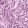
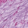
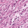

# 公开 PathMNIST 样本与训练记录

这里的九张图片来自官方 PathMNIST 测试划分，每个原始类别一张。它们是公开研究图块，不是自有医院数据。

图像原始尺寸为 28×28；下表仅放大显示，没有增加图像细节。

| 原标签 | 样本 | 来源索引（test） |
| --- | --- | --- |
| 0 · adipose |  | 137 |
| 1 · background |  | 77 |
| 2 · debris |  | 17 |
| 3 · lymphocytes |  | 290 |
| 4 · mucus |  | 201 |
| 5 · smooth muscle |  | 36 |
| 6 · normal colon mucosa |  | 691 |
| 7 · cancer-associated stroma |  | 263 |
| 8 · colorectal adenocarcinoma epithelium |  | 446 |

## 来源与使用许可

PathMNIST / MedMNIST v2：Yang, Shi, Wei 等；上游病理数据：Kather, Halama, Marx。
[官方数据](https://zenodo.org/records/10519652) · [CC BY 4.0](https://creativecommons.org/licenses/by/4.0/) · [完整署名与修改说明](../../THIRD_PARTY_NOTICES.md)

选择子集并无损导出 PNG，保留来源索引和九分类标签；训练时增加类别 8 对其余类别的二分类目标。

## 本次实际运行

训练 / 验证 / 测试：900 / 270 / 270 张。
小型 CNN 训练 5 轮，根据验证损失选模；测试阈值固定为 0.5。

| 指标 | 实测值 |
| --- | --- |
| accuracy | 0.8889 |
| sensitivity | 0.0000 |
| specificity | 1.0000 |
| precision | 未定义（分母为零） |
| f1 | 0.0000 |
| tp | 0 |
| tn | 240 |
| fp | 0 |
| fn | 30 |

**本次基线没有检出阳性样本。准确率受负类占比影响，不能据此称模型有效。**
这次运行仅验证公开数据、训练、选模、评估和结果追溯链路；后续模型改进需要新的预先定义实验。

完整参数、训练曲线、校验值和环境版本见 [experiment.json](experiment.json)。
这些数字是本项目运行所得，未采用论文的成绩；不是原始九分类基准成绩，也不是临床诊断准确率。
NPZ 不提供患者身份索引，采用原始官方划分，不声称已经重新核验患者级独立性。

复现步骤见 [公开数据文档](../../docs/public-data.md)。模型权重与完整数据包保存在本地，不加入仓库。
